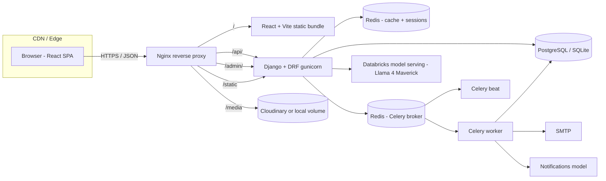
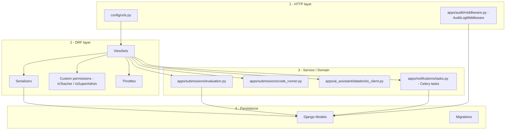
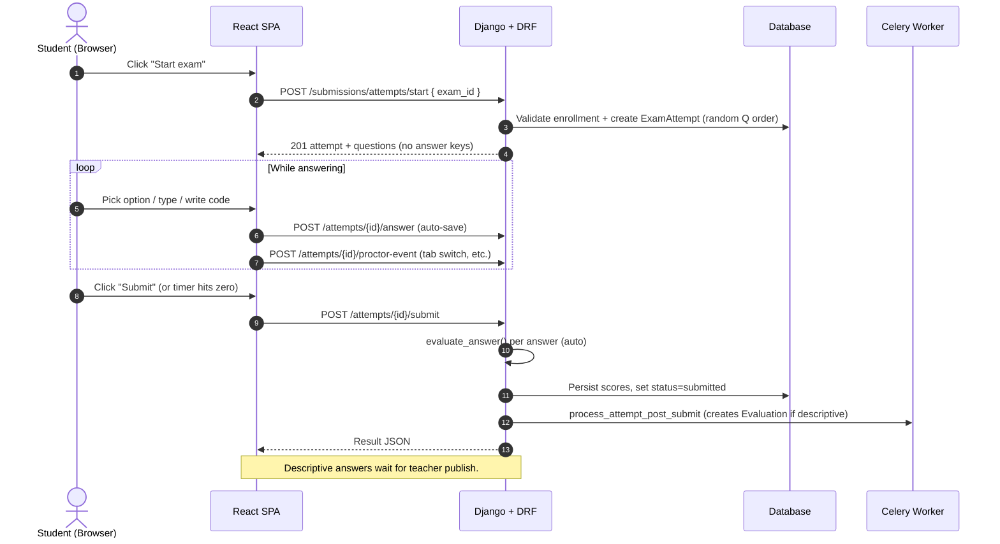
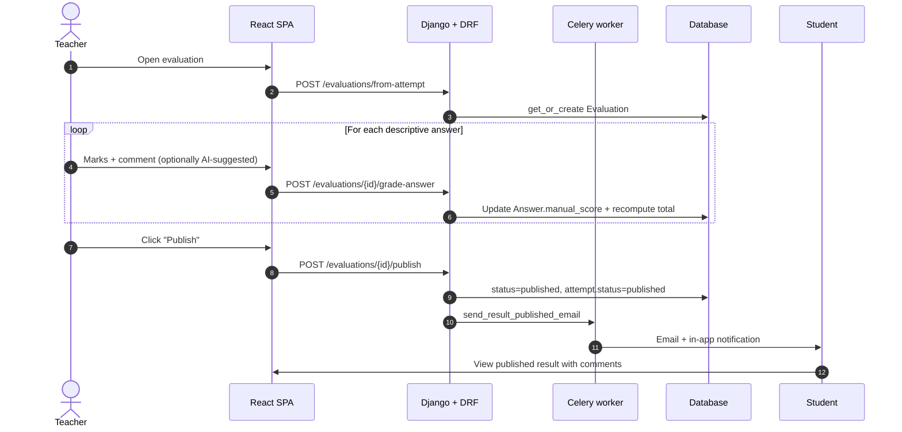

# Architecture

## High-level

```mermaid
flowchart LR
    subgraph CDN["CDN / Edge"]
      U[Browser - React SPA]
    end

    U -->|HTTPS / JSON| RP[Nginx reverse proxy]

    RP -->|/| FE[React + Vite static bundle]
    RP -->|/api/| BE[Django + DRF gunicorn]
    RP -->|/admin/| BE
    RP -->|/static| BE
    RP -->|/media| MEDIA[(Cloudinary or local volume)]

    BE --> DB[(PostgreSQL / SQLite)]
    BE --> CACHE[(Redis - cache + sessions)]
    BE --> BROKER[(Redis - Celery broker)]
    BROKER --> WORKER[Celery worker]
    BROKER --> BEAT[Celery beat]
    WORKER --> DB
    WORKER --> SMTP[SMTP]
    WORKER --> NOTIFY[Notifications model]

    BE --> AI[Databricks model serving - Llama 4 Maverick]
```

## Layered backend

```mermaid
flowchart TB
    subgraph Layer1["1 - HTTP layer"]
      CFG_URLS[config/urls.py]
      MID[apps/audit/middleware.py - AuditLogMiddleware]
    end

    subgraph Layer2["2 - DRF layer"]
      VS[ViewSets]
      SER[Serializers]
      PERM[Custom permissions - IsTeacher / IsSuperAdmin]
      THR[Throttles]
    end

    subgraph Layer3["3 - Service / Domain"]
      EVAL[apps/submissions/evaluation.py]
      RUNNER[apps/submissions/code_runner.py]
      DB_AI[apps/ai_assistant/databricks_client.py]
      TASKS[apps/notifications/tasks.py - Celery tasks]
    end

    subgraph Layer4["4 - Persistence"]
      MODELS[Django Models]
      MIGS[Migrations]
    end

    CFG_URLS --> VS
    VS --> SER
    VS --> PERM
    VS --> THR
    VS --> EVAL
    VS --> RUNNER
    VS --> DB_AI
    VS --> TASKS
    SER --> MODELS
    EVAL --> MODELS
    TASKS --> MODELS
    MID --> MODELS
```

## Exam attempt flow

```mermaid
sequenceDiagram
    autonumber
    actor S as Student (Browser)
    participant FE as React SPA
    participant BE as Django + DRF
    participant DB as Database
    participant CW as Celery Worker

    S->>FE: Click "Start exam"
    FE->>BE: POST /submissions/attempts/start { exam_id }
    BE->>DB: Validate enrollment + create ExamAttempt (random Q order)
    BE-->>FE: 201 attempt + questions (no answer keys)

    loop While answering
      S->>FE: Pick option / type / write code
      FE->>BE: POST /attempts/{id}/answer  (auto-save)
      FE->>BE: POST /attempts/{id}/proctor-event  (tab switch, etc.)
    end

    S->>FE: Click "Submit" (or timer hits zero)
    FE->>BE: POST /attempts/{id}/submit
    BE->>BE: evaluate_answer() per answer (auto)
    BE->>DB: Persist scores, set status=submitted
    BE->>CW: process_attempt_post_submit (creates Evaluation if descriptive)
    BE-->>FE: Result JSON

    Note over BE,FE: Descriptive answers wait for teacher publish.
```

## Result publication flow

```mermaid
sequenceDiagram
    autonumber
    actor T as Teacher
    participant FE as React SPA
    participant BE as Django + DRF
    participant CW as Celery worker
    participant DB as Database
    participant ST as Student

    T->>FE: Open evaluation
    FE->>BE: POST /evaluations/from-attempt
    BE->>DB: get_or_create Evaluation
    loop For each descriptive answer
      T->>FE: Marks + comment (optionally AI-suggested)
      FE->>BE: POST /evaluations/{id}/grade-answer
      BE->>DB: Update Answer.manual_score + recompute total
    end
    T->>FE: Click "Publish"
    FE->>BE: POST /evaluations/{id}/publish
    BE->>DB: status=published, attempt.status=published
    BE->>CW: send_result_published_email
    CW->>ST: Email + in-app notification
    ST->>FE: View published result with comments
```
