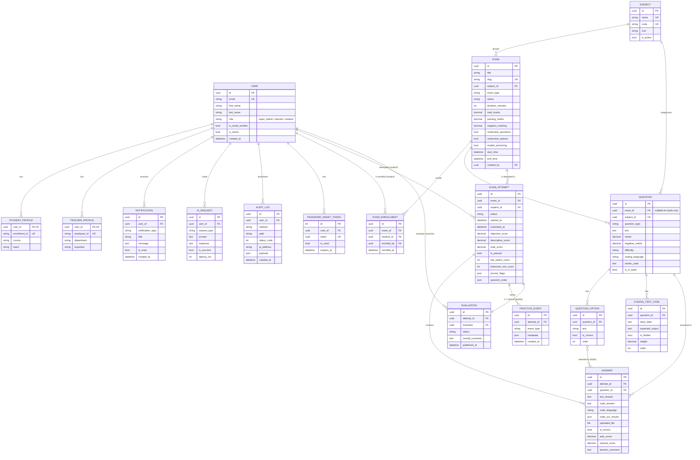

# Entity-Relationship diagram

> Render this with any Mermaid-aware viewer (GitHub, VS Code Markdown Preview Mermaid Support, etc.)

```mermaid
erDiagram
    USER ||--o{ STUDENT_PROFILE : has
    USER ||--o{ TEACHER_PROFILE : has
    USER ||--o{ NOTIFICATION : receives
    USER ||--o{ AI_REQUEST : made
    USER ||--o{ AUDIT_LOG : performed
    USER ||--o{ PASSWORD_RESET_TOKEN : has

    SUBJECT ||--o{ EXAM : groups
    EXAM ||--o{ EXAM_ENROLLMENT : enrolls
    USER ||--o{ EXAM_ENROLLMENT : "is enrolled (student)"

    EXAM ||--o{ QUESTION : contains
    SUBJECT ||--o{ QUESTION : categorises
    QUESTION ||--o{ QUESTION_OPTION : has
    QUESTION ||--o{ CODING_TEST_CASE : has

    EXAM ||--o{ EXAM_ATTEMPT : "is attempted in"
    USER ||--o{ EXAM_ATTEMPT : "attempted (student)"

    EXAM_ATTEMPT ||--o{ ANSWER : contains
    QUESTION ||--o{ ANSWER : "answered in"
    QUESTION_OPTION }o--o{ ANSWER : "selected by (M2M)"
    EXAM_ATTEMPT ||--o{ PROCTOR_EVENT : raises

    EXAM_ATTEMPT ||--|| EVALUATION : "1:1 manual grading"
    USER ||--o{ EVALUATION : "evaluator (teacher)"

    USER {
        uuid id PK
        string email UK
        string first_name
        string last_name
        string role  "super_admin | teacher | student"
        bool is_email_verified
        bool is_active
        datetime created_at
    }

    STUDENT_PROFILE {
        uuid user_id PK,FK
        string enrollment_id UK
        string course
        string batch
    }

    TEACHER_PROFILE {
        uuid user_id PK,FK
        string employee_id UK
        string department
        string expertise
    }

    SUBJECT {
        uuid id PK
        string name UK
        string code UK
        string icon
        bool is_active
    }

    EXAM {
        uuid id PK
        string title
        string slug UK
        uuid subject_id FK
        string exam_type
        string status
        int duration_minutes
        decimal total_marks
        decimal passing_marks
        decimal negative_marking
        bool randomize_questions
        bool randomize_options
        bool enable_proctoring
        datetime start_time
        datetime end_time
        uuid created_by FK
    }

    EXAM_ENROLLMENT {
        uuid id PK
        uuid exam_id FK
        uuid student_id FK
        uuid enrolled_by FK
        datetime enrolled_at
    }

    QUESTION {
        uuid id PK
        uuid exam_id FK "nullable for bank-only"
        uuid subject_id FK
        string question_type
        text text
        decimal marks
        decimal negative_marks
        string difficulty
        string coding_language
        text starter_code
        bool is_in_bank
    }

    QUESTION_OPTION {
        uuid id PK
        uuid question_id FK
        string text
        bool is_correct
        int order
    }

    CODING_TEST_CASE {
        uuid id PK
        uuid question_id FK
        text input_data
        text expected_output
        bool is_hidden
        decimal weight
        int order
    }

    EXAM_ATTEMPT {
        uuid id PK
        uuid exam_id FK
        uuid student_id FK
        string status
        datetime started_at
        datetime submitted_at
        decimal objective_score
        decimal descriptive_score
        decimal total_score
        bool is_passed
        int tab_switch_count
        int fullscreen_exit_count
        json proctor_flags
        json question_order
    }

    ANSWER {
        uuid id PK
        uuid attempt_id FK
        uuid question_id FK
        text text_answer
        text code_answer
        string code_language
        json code_run_results
        file uploaded_file
        bool is_correct
        decimal auto_score
        decimal manual_score
        text teacher_comment
    }

    PROCTOR_EVENT {
        uuid id PK
        uuid attempt_id FK
        string event_type
        json metadata
        datetime created_at
    }

    EVALUATION {
        uuid id PK
        uuid attempt_id FK
        uuid evaluator FK
        string status
        text overall_comment
        datetime published_at
    }

    NOTIFICATION {
        uuid id PK
        uuid user_id FK
        string notification_type
        string title
        text message
        bool is_read
        datetime created_at
    }

    AI_REQUEST {
        uuid id PK
        uuid user_id FK
        string request_type
        text prompt
        text response
        bool is_success
        int latency_ms
    }

    AUDIT_LOG {
        uuid id PK
        uuid user_id FK
        string method
        string path
        int status_code
        string ip_address
        json payload
        datetime created_at
    }

    PASSWORD_RESET_TOKEN {
        int id PK
        uuid user_id FK
        uuid token UK
        bool is_used
        datetime expires_at
    }
```
